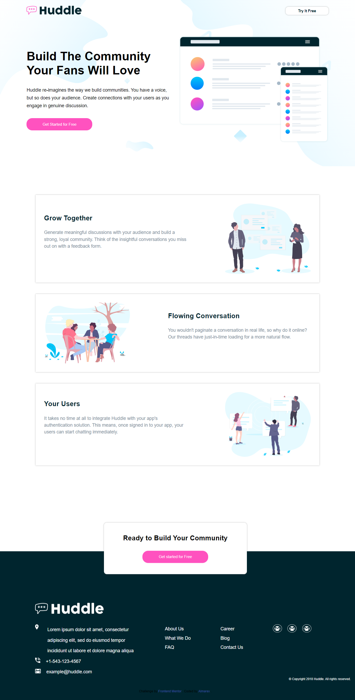

# Frontend Mentor - Huddle landing page with alternating feature blocks solution

This is my own solution to the [Huddle landing page with alternating feature blocks challenge on Frontend Mentor](https://huddle-website-project.netlify.app/).

This is a solution to the [Huddle landing page with alternating feature blocks challenge on Frontend Mentor](https://www.frontendmentor.io/solutions/responsive-landing-page-flexbox-css-preprocessor-0caUjXwoDN). Frontend Mentor challenges help you improve your coding skills by building realistic projects.

## Table of contents

- [Overview](#overview)
  - [The challenge](#the-challenge)
  - [Screenshot](#screenshot)
  - [Links](#links)
- [My process](#my-process)
  - [Built with](#built-with)
  - [What I learned](#what-i-learned)
  - [Continued development](#continued-development)
  - [Useful resources](#useful-resources)
- [Author](#author)

## Overview

### The challenge

Users should be able to:

- View the optimal layout for the site depending on their device's screen size
- See hover states for all interactive elements on the page

### Screenshot

Here's the screenshot of the completed porject below



### Links

- Solution URL: [Add solution URL here](https://www.frontendmentor.io/solutions/responsive-landing-page-flexbox-css-preprocessor-0caUjXwoDN)
- Live Site URL: [Add live site URL here](https://huddle-website-project.netlify.app)

## My process

### Built with

- Semantic HTML5 markup
- CSS custom properties
- CSS preprocessor : SASS
- Flexbox
- CSS Grid
- Responsive Layout

### What I learned

The purpose of buidling this project with scss wast to revised what I have learnt about sass sometimes ago and I realised that the knowledge is still there to an extent. but there were some properties I nearly forgot how to use them. I provided some examples of some sass functions and keyword below

```scss
@mixin & @include, @include custom-name {
  display: flex;
  justify-content: center;
  align-items: center;
}

This in-built sass properties @mixin basically allows to create chunks of code and use it multiple times using the @include keyword accross our file. It's something that is supper benefial to use.
```

If you want more help with writing markdown, we'd recommend checking out [The Markdown Guide](https://www.markdownguide.org/) to learn more.

### Continued development

There are lots of functions and properties in sass that will enhannce your development much faster if you know them, that is why i still have to focus more on how to implement all the great features of sass like the `scss @function keyword , @for, @each, @debug and so on`

### Useful resources

This is was a simple project that did not require any resources for me to do except the one provided by Frontend Mentor. They were the necessary resources needed to accomplish this project

## Author

- Website - [Add your name here](https://www.your-site.com)
- Frontend Mentor - [@yourusername](https://www.frontendmentor.io/profile/yourusername)
- Twitter - [@almarexwebdev](https://www.twitter.com/yourusername)
- Youtubr - [Almarex Web Dev](https://youtube.com/c/AlmarexWebDev/)

## Acknowledgments

This is where you can give a hat tip to anyone who helped you out on this project. Perhaps you worked in a team or got some inspiration from someone else's solution. This is the perfect place to give them some credit.
